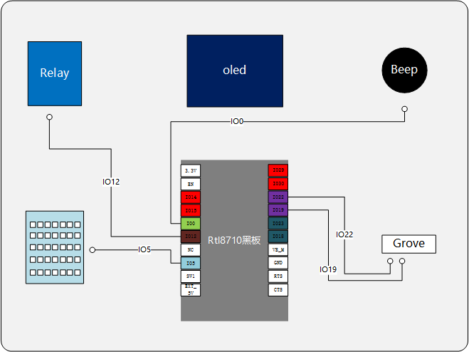
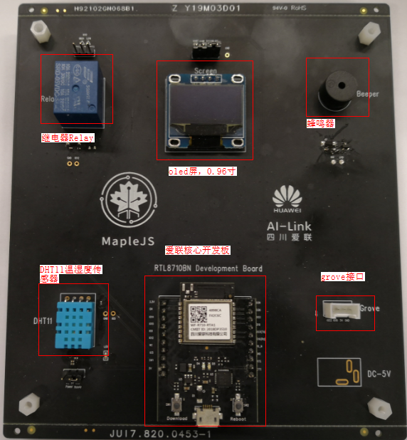

MapleJS是华为推出的面向物联网（IoT）设备侧应用开发的轻量化JavaScript引擎，及其配套的开发工具集。MapleJS可以运行在LiteOS物联网实时操作系统之上并支持HiLink物联网协议，使得开发者能够在资源受限的嵌入式设备上使用JavaScript进行开发；并通过提供统一的设备能力抽象接口，向开发者屏蔽硬件差异，使其更加聚焦业务实现，从而提升IoT设备应用开发效率。

在2019年AWE大会上，展示了MapleJS赋能的IoT设备，其中提供了丰富有趣的功能，一些例子可在`firmware/js脚本例程`中找到，固件可在`tools/爱联模组刷机工具`中找到，刷机教程为该目录下的[README.md](tools/爱联模组刷机工具/README.md)，下面是展示时所使用的开发板的PCB图和硬件实物图：

