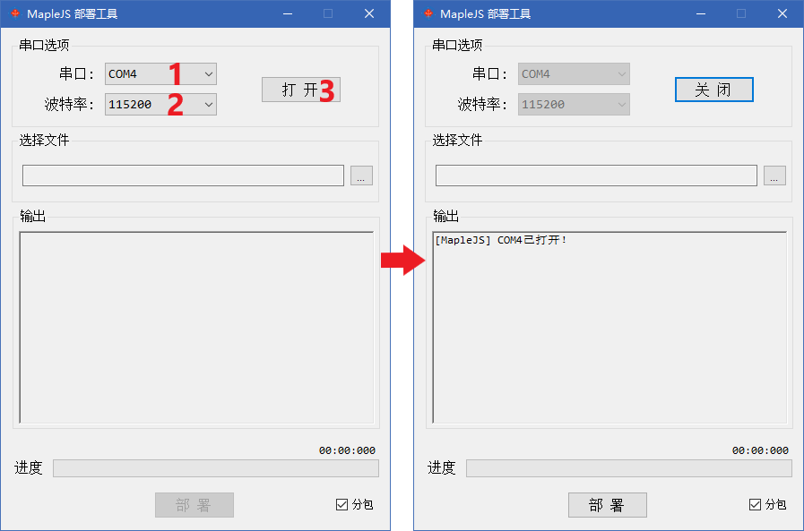
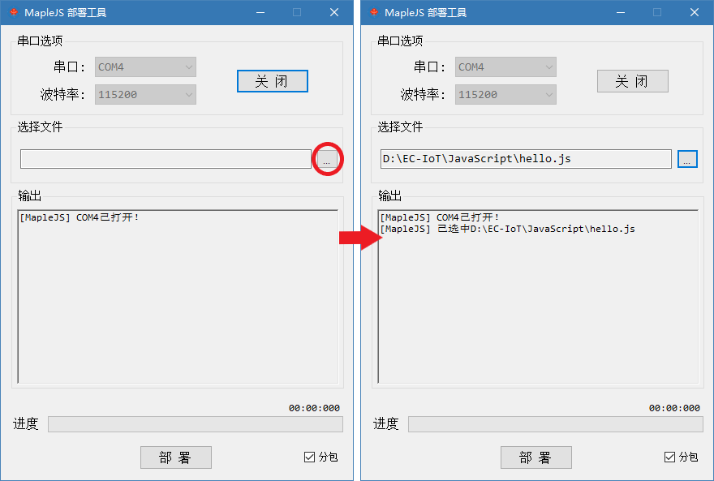
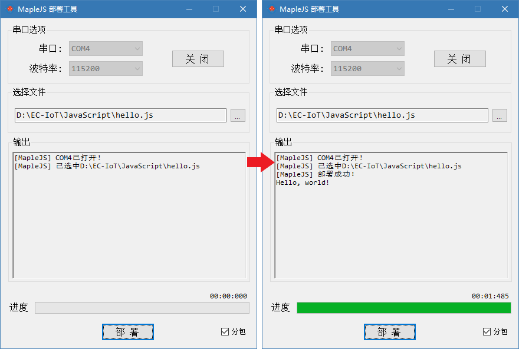

# MapleJS-Deployer

`MapleJS-Deploy.exe`是一款轻量级的文件部署工具，主要用于向`MapleJs`设备部署文件，目前支持以下几种文件格式：

- 二进制文件，以`.?in`为文件后缀名，如：`.din`，`.pin`
- JavaScript文件，以`.js`为文件后缀名
- Snapshot文件，以`.snapshot`为文件后缀名

## 需求

该软件以`.Net 4.0`框架为基础开发，支持`Windows`平台，并需要安装有`.Net 4.x`框架。若无法打开该软件，请[点此链接](https://download.microsoft.com/download/9/5/A/95A9616B-7A37-4AF6-BC36-D6EA96C8DAAE/dotNetFx40_Full_x86_x64.exe)下载并安装`.Net 4.0`框架。

## 使用

### 打开串口

使用串口下拉框选择串口号（左图1位置），使用波特率下拉框选择波特率（左图2位置），之后点击`打开`按钮打开串口，打开成功下方输出区会有相应提示，如右图所示。

关闭串口只需点击右图中`关闭`按钮即可。

### 选择文件

点击左图红色圆圈内的按钮打开选择文件对话框，根据需要选择文件后，按钮左侧的文本框将显示文件名，下方的输出区会有相应提示，如右图所示。

### 部署文件

在打开串口，并选择了文件之后，点击`部署`按钮开始向`MapleJS`设备部署文件，部署成功后，根据文件和设备版本的不同，会有不同的表现。右图中部署完成后立即执行了JavaScript文件，并将其结果输出到输出区。

右下角`分包`复选框控制是否启用分包功能，启用时部署时间将会明显变长，但可支持向flash模式下的`MapleJS`设备部署文件，对于文件系统模式下的`MapleJS`设备，该选项启用与否并无明显区别，默认启用。