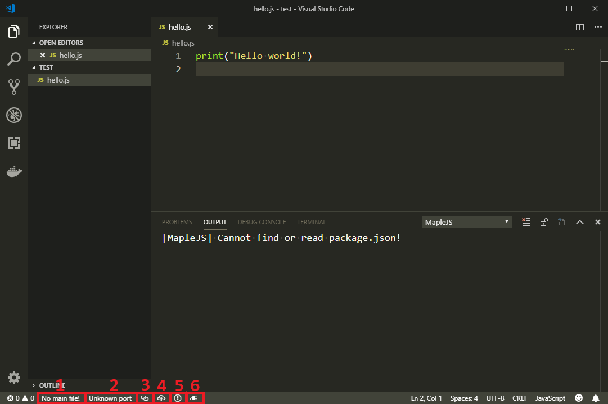
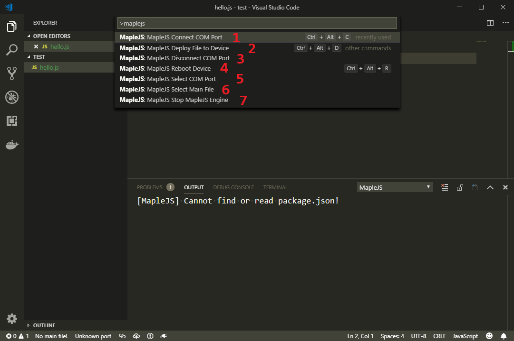
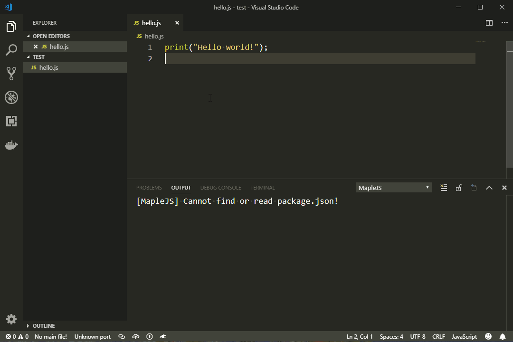
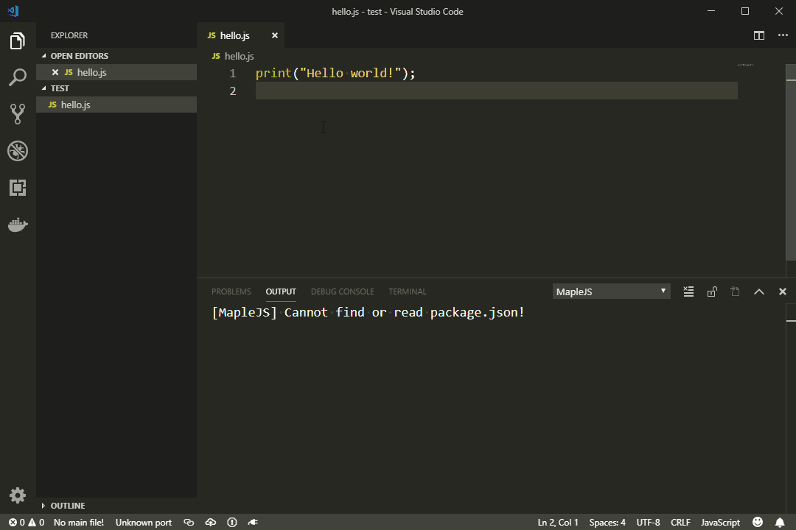
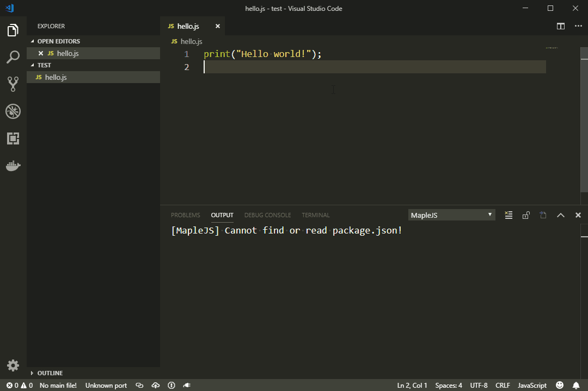

## VSC-AntJS

`MapleJS for Visual Studio Code (vsc-antjs)` 是以 [Visual Studio code](https://code.visualstudio.com/) 为基础的MapleJS开发工具，目前已支持以下特性：

- 向已连接设备部署代码文件并运行
- 一键重启MapleJS设备
- 源文件压缩
- 中止已连接设备JS引擎的运行

### 1 需求

VS code版本不低于 July 2018 v1.26.1，并根据VS code的架构选择安装 x32 或 x64 版本的插件

建议同时安装 [ESLint](https://marketplace.visualstudio.com/items?itemName=dbaeumer.vscode-eslint) 和 [JavaScript (ES6) code snippets](https://marketplace.visualstudio.com/items?itemName=xabikos.JavaScriptSnippets) ，有助于正确编码

vsc-antjs 需要通过串口读写数据，所以在连接设备前，需要确保已安装USB转串口驱动：

- [Silabs drivers](https://www.silabs.com/products/mcu/Pages/USBtoUARTBridgeVCPDrivers.aspx) for Espressif esp8266/esp32
- [CH43x drivers](https://github.com/adrianmihalko/ch340g-ch34g-ch34x-mac-os-x-driver) for Espressif esp8266/esp32
- [FTDI drivers](http://www.ftdichip.com/Drivers/VCP.htm) for CC3200, CC3220

### 2 安装

方式一：通过VS code客户端

操作步骤如下图


之后在弹出的窗口内找到自己的插件安装包即可，安装完毕后VS code右下角会提示重新加载客户端，重启即可使用此插件

方式二：通过命令行

首先下载对应版本的插件安装包 `*.vsix`，然后使用命令行切换到插件所在目录，然后执行下面的代码

```
code --install-extension vscode-antjs-0.4.0-x32.vsix
```

安装之后，打开VS Code即可在扩展列表内看到 `vsc-antjs`

### 3 配置

vsc-antjs支持通过配置文件进行配置，读取的配置文件为工作目录下的 `package.json` ，使用VS code打开工作目录（必须使用打开文件夹才可以使用完整的插件功能），vsc-antjs 会读取 `package.json` 的中的五项配置：

```json
{
    "main":"src/main.js",
    "port":"COM5",
    "isCompress":true,
    "isPacket":true,
    "packOpt":{
        "treeshake":true
    }
}
```

- main: 该参数指定用于部署到设备中的目标JS文件
- port: 该参数指定用于连接设备的串口号
- isCompress: 该参数指定部署前是否对目标文件进行压缩，默认为`true`
- isPacket: 该参数指定部署文件时是否使用分包部署的方式，默认为`true`
- packOpt: 该参数用于配置`rollup`机制，目前支持以下配置项：
  - treeshake，用于配置是否启用`treeshaking`机制，默认为`true`；`treeshaking`是一种死代码删除优化，如果不希望去除冗余代码，可以设置为`false`，关闭该优化；

### 4 使用

插件支持通过按钮和命令面板两种方式使用，效果一致。主要的按钮有6个，如下图所示：



按钮1：main file，点击此按钮会弹出所有可供选择的JS文件，选中的文件可通过deploy按钮部署到设备上；

按钮2：COM port，点击此按钮会弹出可以使用的COM口，插件会通过选中的COM口连接设备；

按钮3：connect & disconnect，点击此按钮会通过按钮2选中的COM口与设备建立连接或断开连接；

按钮4：deploy，点击此按钮会将按钮1选中的文件压缩，然后通过按钮2选中的COM口部署到设备里面去；

按钮5：stop，点击此按钮可中止已连接设备JS引擎的运行；

按钮6：reboot，点击此按钮可重启设备。

命令面板可以通过组合键 `Ctrl + shift + p` 打开，支持的命令如下图所示：



插件共注册了7个命令，如上图所示，所有的命令和点击按钮的效果都是一样的。按钮3在这里对应了两个命令，分别为 connect 和 disconnect 。

下面是对插件支持的每个操作的动图演示，分别通过按钮和命令行两种方式实现

#### 4.1 选择文件

使用按钮：点击选择文件按钮（无选中下显示为`No main file!`，已有选中下显示已选中的文件名），在弹出的列表中选择需要部署的文件，选择完成后，选择文件按钮会显示刚被选中的文件名



使用命令：使用 `Ctrl+Shift+p`，在弹出的命令列表中选择 `AntJS: AntJS Select Main File`，在弹出的列表中选择需要部署的文件，选择完成后，选择文件按钮会显示刚被选中的文件名



#### 4.2 选择串口

使用按钮：点击选择串口按钮（无选中下显示为`Unknown port`，已有选中下显示已选中的串口号），在弹出的列表中选择设备连接的串口，选择完成后，选择文件按钮会显示刚被选中的串口号


使用命令：使用 `Ctrl+Shift+p`，在弹出的命令列表中选择 `AntJS: AntJS Select COM Port`，在弹出的列表中选择设备连接的串口，选择完成后，选择文件按钮会显示刚被选中的串口号



#### 4.3 串口连接/断开连接

使用按钮：点击按钮，若设备已连接，则断开连接，否则建立连接


使用命令：使用 `Ctrl+Shift+p`，在弹出的命令列表中选择 `AntJS: AntJS Connect COM Port`，和设备建立连接，选择 `AntJS: AntJS Disconnect COM Port`，和设备断开连接


#### 4.4 文件部署

使用按钮：点击按钮，若已设置好文件和串口，且已连接，则直接部署文件，否则会进行相关提示


使用命令：使用 `Ctrl+Shift+p`，在弹出的命令列表中选择 `AntJS: AntJS Deploy File to Device`，若已设置好文件和串口，且已连接，则直接部署文件，否则会进行相关提示


注意事项：

- 不支持部署空文件
- 部署文件前会将JS文件压缩，该功能不支持在严格模式中被禁止的语法

#### 4.5 中止引擎

使用按钮：点击按钮，若设备已连接，则会向设备发送stop script命令使得设备中止JS引擎的运行（由于设备和PC通过串口连接，在直观上可能存在延迟），否则会进行相关提示


使用命令：使用 `Ctrl+Shift+p`，在弹出的命令列表中选择 `AntJS: AntJS Stop AntJS Engine`，若设备已连接，则会向设备发送stop script命令使得设备中止JS引擎的运行（由于设备和PC通过串口连接，在直观上可能存在延迟），否则会进行相关提示


注意：此功能仅适用于循环结构（for循环、while循环等）

#### 4.6 重启设备

使用按钮：点击按钮，若已设置好串口，且已连接，则会向设备发送reboot命令使设备reboot，否则会进行相关提示


使用命令：使用 `Ctrl+Shift+p`，在弹出的命令列表中选择 `AntJS: AntJS Reboot Device`，若已设置好串口，且已连接，则会向设备发送reboot命令使设备reboot，否则会进行相关提示


