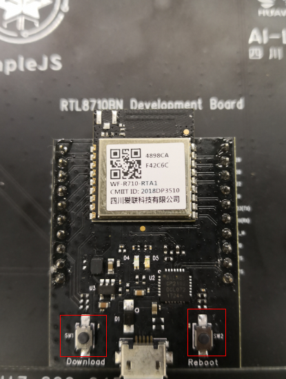
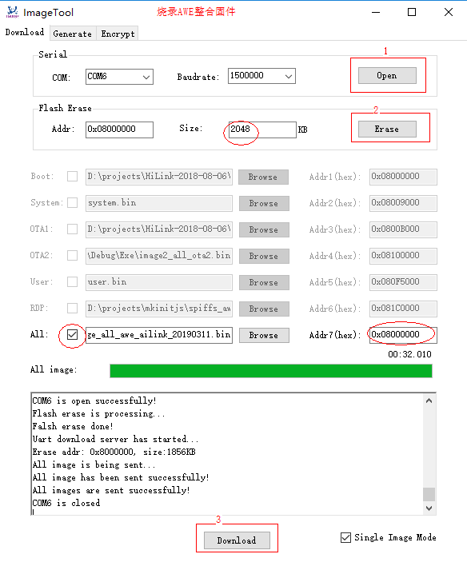
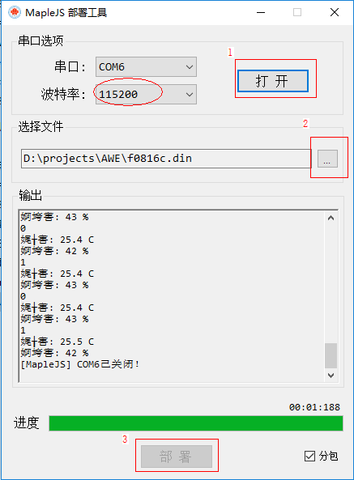
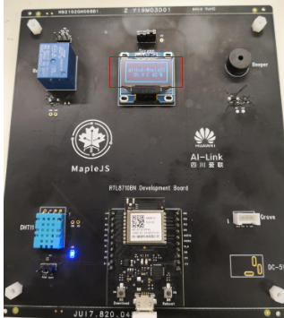
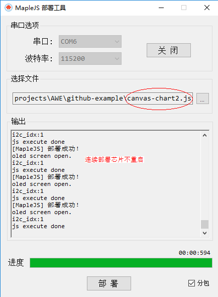
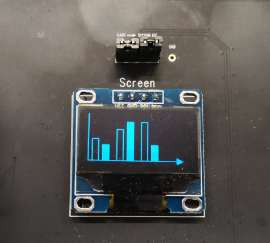

# MapleJS Demo板固件烧录

### Step1 准备文件

- **MapleJS/tools/爱联模组刷机工具/**

  `CP210x_Universal_Windows_Driver.zip`是爱联模块的串口驱动。（安装省略）

  `amebaz-image-tool-v2.0.zip`是爱联模组的刷机工具，可以分区刷固件，也可以刷整体固件。（绿色版，无需安装）

- **MapleJS/tools/JS脚本下载工具/**

  `MapleJS-Deploy.exe`是下载JS脚本和字库的工具。（绿色版，无需安装）

- **MapleJS/firmware/**

  `f0816c.din`是TFT、INK、OLED屏幕的字库，大小为8*16。

  `image_all_awe_ailink_20190311.bin`是各个分区整合在一起的固件。

### Step2 进入刷机模式

通电状态下按住`Download`，然后按一下`Reboot`，最后释放所有按键。这样就进入刷机模式。

### Step3 打开刷机软件。

- 选择串口，波特率不用修改，点击`Open`。

- 擦除flash（大小为2MB），size中填入2048，点`Erase`。

- 选中`All`，`addr7`位0x08000000，点击`Download`。
- 刷机完成后点击`Reboot`。

### Step4 下载字库和js脚本。

为AWE整合的固件中包含一个js脚本，但是没有预置OLED屏的字库，你可能会发现屏上只有一个框没有文字。需要通过MapleJS的脚本下载工具下载一个字库进去。

- 打开串口，波特率为115200，点击`打开`。
- 选择要部署的文件，`f0816c.din`。
- 点击`部署`

下载字库后，oled屏正常显示了。

同样的方法，下载js脚本。

基于MapleJS的canvas画了一个条形图。

